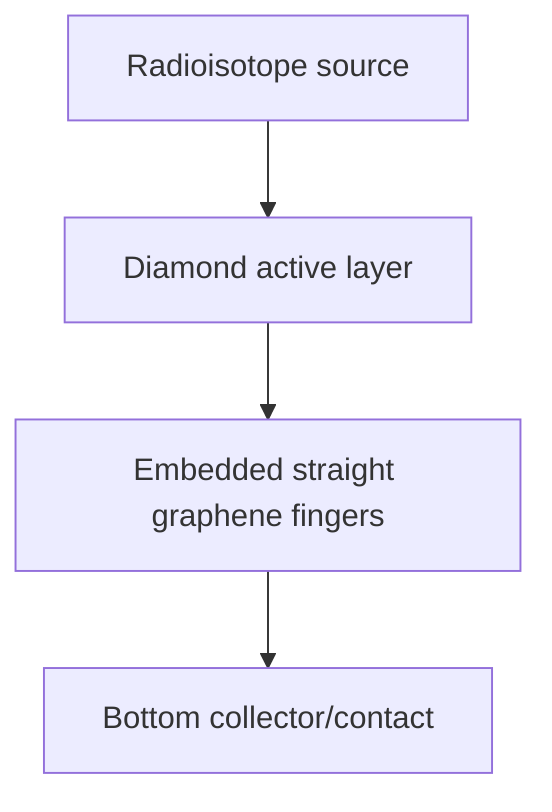
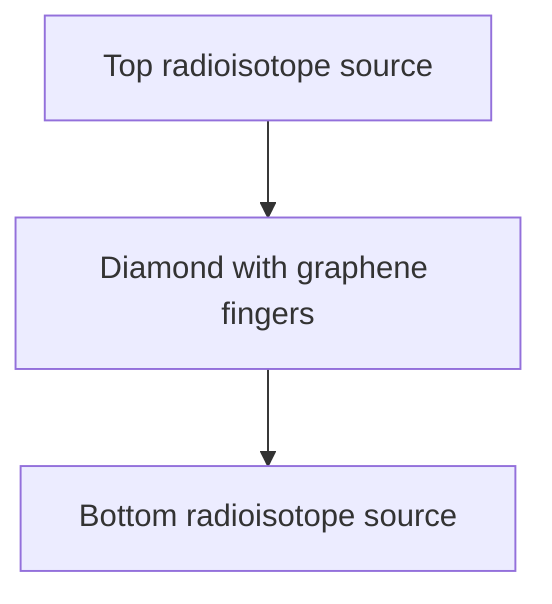
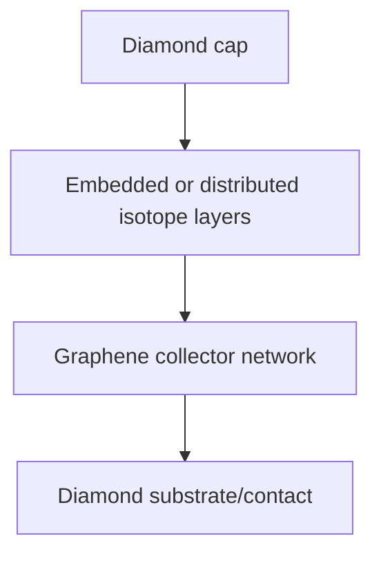
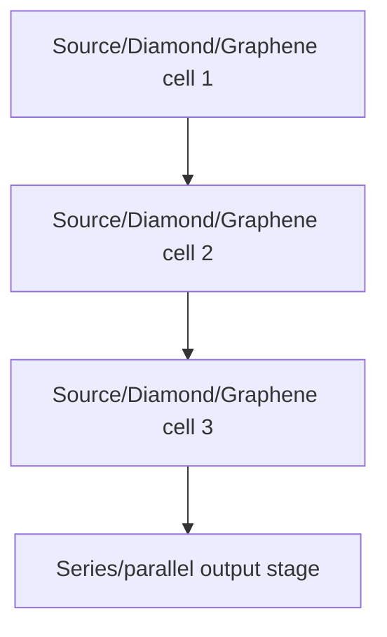

# Generation-6 Device-Level Diamond-Graphene Betavoltaic Architecture Study

## Final Conclusions

A. Best overall device architecture: **dual_sided_source** with Ni63.
B. Best isotope: **Ni63** for packaging-adjusted power; C-14 generally wins raw energy deposition, Ni-63 is more compact, Tritium is least favorable here.
C. Best isotope placement: **dual_surface**.
D. Best collector geometry: **straight embedded graphene fingers** for manufacturable designs; 3D collectors only win raw collection in narrow cases but fail complexity penalties.
E. Best manufacturable design: **top_source** with Ni63.
F. Best commercialization path: **top_source** with Ni63.
G. Distributed or embedded isotope layers outperform surface-mounted sources after penalties: **NO**.
H. Multilayer architectures justify complexity: **NO**.
I. Diamond + straight graphene finger concept remains winner after full device optimization: **PARTLY**.

## Device Cross-Section Diagrams

## Table 1: Best Architecture By Power

| Rank | Architecture | Source | Metric | Power | Lifetime | CCE | Utilization | Mfg | Dominant loss |
|---:|---|---|---:|---:|---:|---:|---:|---:|---|
| 1 | dual_sided_source | Ni63 | 1.2061e-08 | 4.9009e-08 | 0.000174 | 0.314 | 0.768 | 0.42 | graphene_interface |
| 2 | top_source | Ni63 | 1.0725e-08 | 2.6003e-08 | 0.000259 | 0.160 | 0.569 | 0.57 | carrier_recombination |
| 3 | bottom_source | Ni63 | 7.6701e-09 | 1.9894e-08 | 0.00029 | 0.125 | 0.500 | 0.55 | carrier_recombination |
| 4 | radial_collector | Ni63 | 7.5956e-09 | 3.6500e-08 | 0.000226 | 0.234 | 0.569 | 0.40 | graphene_interface |
| 5 | embedded_source | Ni63 | 4.6436e-09 | 3.7939e-08 | 0.000182 | 0.249 | 0.654 | 0.31 | packaging |
| 6 | distributed_source | Ni63 | 2.8762e-09 | 4.4631e-08 | 0.00014 | 0.307 | 0.796 | 0.23 | packaging |
| 7 | stacked_multilayer | Ni63 | 1.4740e-09 | 4.1359e-08 | 0.000114 | 0.300 | 0.938 | 0.18 | packaging |
| 8 | three_dimensional_collector | Ni63 | 4.0113e-10 | 2.2274e-08 | 0.000158 | 0.171 | 0.654 | 0.13 | packaging |

## Table 2: Best Architecture By Lifetime

| Rank | Architecture | Source | Metric | Power | Lifetime | CCE | Utilization | Mfg | Dominant loss |
|---:|---|---|---:|---:|---:|---:|---:|---:|---|
| 1 | bottom_source | Tritium | 5.3213e-03 | 9.8104e-10 | 0.00532 | 0.187 | 0.814 | 0.55 | carrier_recombination |
| 2 | top_source | Tritium | 4.7513e-03 | 1.2829e-09 | 0.00475 | 0.239 | 0.925 | 0.57 | carrier_recombination |
| 3 | dual_sided_source | Tritium | 4.1747e-03 | 1.1787e-09 | 0.00417 | 0.229 | 0.955 | 0.42 | carrier_recombination |
| 4 | radial_collector | Tritium | 4.1459e-03 | 1.1491e-09 | 0.00415 | 0.224 | 0.925 | 0.40 | carrier_recombination |
| 5 | embedded_source | Tritium | 3.7384e-03 | 1.7470e-09 | 0.00374 | 0.347 | 0.952 | 0.31 | packaging |
| 6 | distributed_source | Tritium | 3.4819e-03 | 1.4026e-09 | 0.00348 | 0.293 | 0.955 | 0.23 | packaging |
| 7 | stacked_multilayer | Tritium | 3.3338e-03 | 9.6062e-10 | 0.00333 | 0.212 | 0.955 | 0.18 | carrier_recombination |
| 8 | three_dimensional_collector | Tritium | 3.2407e-03 | 8.5044e-10 | 0.00324 | 0.198 | 0.952 | 0.13 | packaging |

## Table 3: Best Architecture By Manufacturability

| Rank | Architecture | Source | Metric | Power | Lifetime | CCE | Utilization | Mfg | Dominant loss |
|---:|---|---|---:|---:|---:|---:|---:|---:|---|
| 1 | top_source | Ni63 | 5.7287e-01 | 1.1395e-09 | 0.00202 | 0.071 | 0.251 | 0.57 | carrier_recombination |
| 2 | bottom_source | Ni63 | 5.5079e-01 | 8.6401e-10 | 0.00226 | 0.055 | 0.221 | 0.55 | carrier_recombination |
| 3 | dual_sided_source | Ni63 | 4.2431e-01 | 1.3867e-09 | 0.00135 | 0.090 | 0.338 | 0.42 | carrier_recombination |
| 4 | radial_collector | Ni63 | 4.0019e-01 | 1.0325e-09 | 0.00176 | 0.067 | 0.251 | 0.40 | carrier_recombination |
| 5 | embedded_source | Ni63 | 3.0599e-01 | 1.4277e-09 | 0.00142 | 0.095 | 0.288 | 0.31 | carrier_recombination |
| 6 | distributed_source | Ni63 | 2.3015e-01 | 1.5664e-09 | 0.00109 | 0.110 | 0.351 | 0.23 | carrier_recombination |
| 7 | stacked_multilayer | Ni63 | 1.7820e-01 | 1.2966e-09 | 0.000885 | 0.096 | 0.414 | 0.18 | carrier_recombination |
| 8 | three_dimensional_collector | Ni63 | 1.2864e-01 | 7.3227e-10 | 0.00137 | 0.057 | 0.258 | 0.13 | packaging |

## Table 4: Best Architecture By Power Per Dollar

| Rank | Architecture | Source | Metric | Power | Lifetime | CCE | Utilization | Mfg | Dominant loss |
|---:|---|---|---:|---:|---:|---:|---:|---:|---|
| 1 | top_source | Ni63 | 1.0725e-08 | 2.6003e-08 | 0.000259 | 0.160 | 0.569 | 0.57 | carrier_recombination |
| 2 | dual_sided_source | Ni63 | 8.3180e-09 | 4.9009e-08 | 0.000174 | 0.314 | 0.768 | 0.42 | graphene_interface |
| 3 | bottom_source | Ni63 | 7.3048e-09 | 1.9894e-08 | 0.00029 | 0.125 | 0.500 | 0.55 | carrier_recombination |
| 4 | radial_collector | Ni63 | 4.6034e-09 | 3.6500e-08 | 0.000226 | 0.234 | 0.569 | 0.40 | graphene_interface |
| 5 | embedded_source | Ni63 | 2.4440e-09 | 3.7939e-08 | 0.000182 | 0.249 | 0.654 | 0.31 | packaging |
| 6 | distributed_source | Ni63 | 1.1984e-09 | 4.4631e-08 | 0.00014 | 0.307 | 0.796 | 0.23 | packaging |
| 7 | stacked_multilayer | Ni63 | 4.6062e-10 | 4.1359e-08 | 0.000114 | 0.300 | 0.938 | 0.18 | packaging |
| 8 | three_dimensional_collector | Ni63 | 1.0556e-10 | 2.2274e-08 | 0.000158 | 0.171 | 0.654 | 0.13 | packaging |

## Table 5: Best Architecture By Power Per Cubic Centimeter

| Rank | Architecture | Source | Metric | Power | Lifetime | CCE | Utilization | Mfg | Dominant loss |
|---:|---|---|---:|---:|---:|---:|---:|---:|---|
| 1 | top_source | Ni63 | 5.8880e-06 | 1.7130e-08 | 0.000202 | 0.105 | 0.251 | 0.57 | carrier_recombination |
| 2 | dual_sided_source | Ni63 | 4.9476e-06 | 2.4125e-08 | 0.000135 | 0.155 | 0.338 | 0.42 | graphene_interface |
| 3 | bottom_source | Ni63 | 4.2016e-06 | 1.3077e-08 | 0.000226 | 0.082 | 0.221 | 0.55 | carrier_recombination |
| 4 | radial_collector | Ni63 | 3.1163e-06 | 1.7970e-08 | 0.000176 | 0.116 | 0.251 | 0.40 | graphene_interface |
| 5 | embedded_source | Ni63 | 1.9618e-06 | 1.9233e-08 | 0.000142 | 0.127 | 0.288 | 0.31 | packaging |
| 6 | distributed_source | Ni63 | 1.1197e-06 | 2.0849e-08 | 0.000109 | 0.144 | 0.351 | 0.23 | packaging |
| 7 | stacked_multilayer | Ni63 | 1.9198e-07 | 1.9392e-08 | 8.85e-05 | 0.141 | 0.414 | 0.18 | packaging |
| 8 | three_dimensional_collector | Ni63 | 1.6883e-07 | 1.1249e-08 | 0.000123 | 0.087 | 0.288 | 0.13 | packaging |

## Table 6: Source Utilization Efficiency

| Rank | Source | Placement | Median utilization | Best power |
|---:|---|---|---:|---:|
| 1 | Ni63 | dual_surface | 0.512 | 1.2061e-08 |
| 2 | C14 | dual_surface | 0.158 | 1.2001e-08 |
| 3 | Ni63 | above | 0.379 | 1.0725e-08 |
| 4 | C14 | above | 0.117 | 1.0672e-08 |
| 5 | Ni63 | below | 0.334 | 7.6701e-09 |
| 6 | C14 | below | 0.103 | 7.6319e-09 |
| 7 | Tritium | above | 0.839 | 6.9025e-09 |
| 8 | Tritium | dual_surface | 0.955 | 5.6017e-09 |
| 9 | Tritium | below | 0.738 | 4.9278e-09 |
| 10 | Ni63 | embedded | 0.393 | 4.6436e-09 |
| 11 | C14 | embedded | 0.121 | 4.6207e-09 |
| 12 | Ni63 | distributed | 0.531 | 2.8762e-09 |
| 13 | C14 | distributed | 0.164 | 2.8620e-09 |
| 14 | Tritium | embedded | 0.880 | 2.5940e-09 |
| 15 | Ni63 | stacked | 0.626 | 1.4740e-09 |
| 16 | C14 | stacked | 0.193 | 1.4668e-09 |
| 17 | Tritium | distributed | 0.960 | 1.2437e-09 |
| 18 | Tritium | stacked | 0.974 | 5.5248e-10 |

## Table 7: Packaging-Adjusted Rankings

| Rank | Architecture | Source | Metric | Power | Lifetime | CCE | Utilization | Mfg | Dominant loss |
|---:|---|---|---:|---:|---:|---:|---:|---:|---|
| 1 | dual_sided_source | Ni63 | 1.2061e-08 | 4.9009e-08 | 0.000174 | 0.314 | 0.768 | 0.42 | graphene_interface |
| 2 | top_source | Ni63 | 1.0725e-08 | 2.6003e-08 | 0.000259 | 0.160 | 0.569 | 0.57 | carrier_recombination |
| 3 | bottom_source | Ni63 | 7.6701e-09 | 1.9894e-08 | 0.00029 | 0.125 | 0.500 | 0.55 | carrier_recombination |
| 4 | radial_collector | Ni63 | 7.5956e-09 | 3.6500e-08 | 0.000226 | 0.234 | 0.569 | 0.40 | graphene_interface |
| 5 | embedded_source | Ni63 | 4.6436e-09 | 3.7939e-08 | 0.000182 | 0.249 | 0.654 | 0.31 | packaging |
| 6 | distributed_source | Ni63 | 2.8762e-09 | 4.4631e-08 | 0.00014 | 0.307 | 0.796 | 0.23 | packaging |
| 7 | stacked_multilayer | Ni63 | 1.4740e-09 | 4.1359e-08 | 0.000114 | 0.300 | 0.938 | 0.18 | packaging |
| 8 | three_dimensional_collector | Ni63 | 4.0113e-10 | 2.2274e-08 | 0.000158 | 0.171 | 0.654 | 0.13 | packaging |

## Diminishing Returns

| Finger count | Median packaging-adjusted power |
|---:|---:|
| 32 | 1.7997e-09 |
| 64 | 2.3179e-09 |
| 128 | 2.8403e-09 |

## Recommendations

- Recommended prototype design: **dual_sided_source**, source=Ni63, diamond=35 um, pitch=6 um, fingers=128.
- Recommended laboratory demonstrator: **top_source** with Ni63.
- Recommended commercial architecture: **top_source** with Ni63.

## Reliability And Manufacturing Assessment

- Dominant loss in best case: graphene_interface.
- Dominant fabrication risk in best case: graphene_alignment.
- Dominant reliability risk in best case: radiation_damage.
- Dominant packaging challenge in best case: contact_routing.
